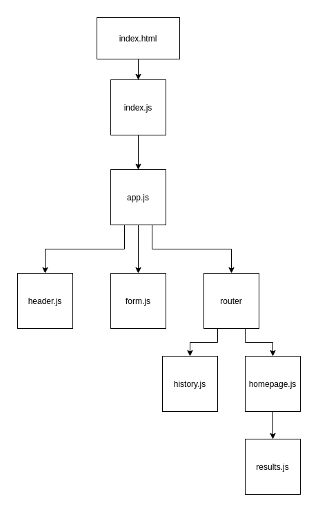

## RESTy
A basic API testing application. Allows you to perform restful actions on an api.
### Author: Travis Skyles

### Links and Resources

- [submission PR](https://github.com/tskyles-401-advanced-javascript/RESTy/pull/1)
- [travis](https://travis-ci.com/tskyles-401-advanced-javascript/RESTy)
- [front-end](https://working.d2yx5do08djvpf.amplifyapp.com/)
- [codesandbox.io](https://codesandbox.io/s/resty-41us7)

### Setup

- `clone repo to local`
- `open in editor`
- `npm i`
- `npm start`

#### Tests

- `npm test`

#### UML

